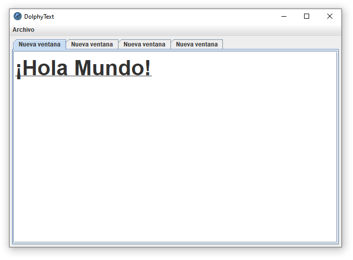
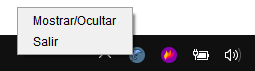

# JDolphyText

JDolphyText es un editor de texto enriquecido multiplataforma desarrollado en Java. Permite abrir, guardar y modificar multiples archivos al mismo tiempo. Los formatos soportados son RTF (simplificación de doc, docx y odf) y TXT.

## Atajos

El editor funcionada mediante shortcuts (atajos) que permiten hacer diversas acciones.

### Atajos para archivos

|        Atajo         |              Acción              |
| :------------------: | :------------------------------: |
|        Ctrl+O        |          Abrir archivo           |
|        Ctrl+S        |         Guardar archivo          |
|        Ctrl+W        |      Cerrar pestaña actual       |
|        Ctrl+M        | Devolver ultima pestaña guardada |
|        Ctrl+P        |     Imprimir pestaña actual      |
| Ctrl+Rueda del mouse |   Agrandar o achicar la letra    |

### Atajos para el texto seleccionado

| Atajo  |                 Acción                 |
| :----: | :------------------------------------: |
| Ctrl+B |                Negrita                 |
| Ctrl+U |               Subrayado                |
| Ctrl+K |           Itálica / Cursiva            |
| Ctrl+T |                Tachado                 |
| Ctrl+Q |       Quitar todos los formatos        |
| Ctrl+G | Alternar entre mayúsculas y minúsculas |
| Ctrl+Z |         Deshacer ultima acción         |
| Ctrl+G |         Rehacer ultima acción          |

### Completado

El editor permite cambiar el carácter seleccionado por otro al presionar Tab mientras se tiene seleccionado"

| Carácter seleccionado | Al aplicar Tab |
| :-------------------: | :------------: |
|           n           |       ñ        |
|           N           |       N        |
|           a           |       á        |
|           A           |       Á        |
|           e           |       é        |
|           E           |       É        |
|           i           |       í        |
|           I           |       Í        |
|           o           |       ó        |
|           u           |       ú        |
|           U           |       Ú        |

## SystemTray

JDolphyText al ejecutarse agrega un SystemTray (un icono a la bandeja del sistema, como la configuración del Wifi, Teclado, Batería, etc). Lo cual permite al usuario ocultarla ventana si perder si progreso.

